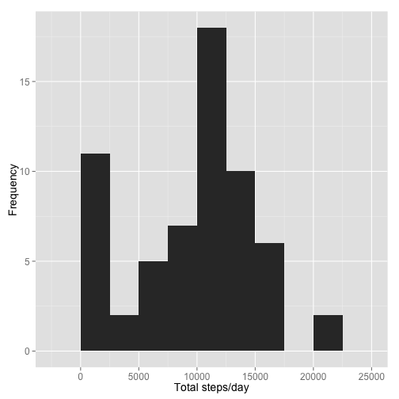
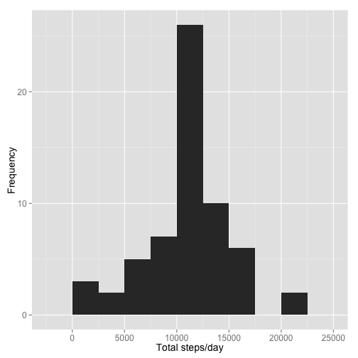
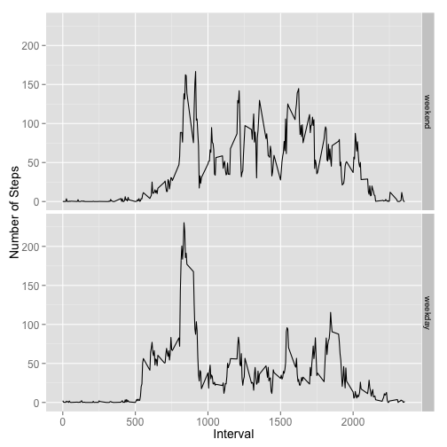

# Reproducible Research: Peer Assessment 1

## Introduction
It is now possible to collect a large amount of data about personal movement using activity monitoring devices such as a [Fitbit] [1] , [Nike Fuelband] [2],
or [Jawbone Up] [3]. These type of devices are part of the “quantified self”
movement – a group of enthusiasts who take measurements about themselves regularly to improve their health, to find patterns in their behavior, or because they are tech geeks. But these data remain underutilized both because the raw data are hard to obtain and there is a lack of statistical methods and software for processing and interpreting the data.

[1]: http://www.fitbit.com "Fitbit"
[2]: http://www.nike.com/us/en_us/c/nikeplusfuelband "Nike Fuelband"
[3]: https://jawbone.com/up "Jawbone Up"

## Loading and preprocessing the data
This assignment makes use of data from a personal activity monitoring device. This device collects data at 5 minute intervals through out the day. The data consists of two months of data from an anonymous individual collected during the months of October and November, 2012 and include the number of steps taken in 5 minute intervals each day.

The data is a comma delimited file, it includes 17,568 observations of 3 variables:  
- **steps:** Number of steps taken in a 5 min interval   
- **date:** The date when the measurement was taken in YYY-MM-DD format   
- **interval:** Identifier for the 5-min interval in which the measurement was taken   

First, we read the date coercing the *date* column to character rather than factor


```r
activityData <- read.csv ("activity.csv", header = T, sep = ",", stringsAsFactors = F)
```

Now we convert the *date* column to the appropriate format:


```r
activityData$date <- as.Date(activityData$date, "%Y-%m-%d")
str(activityData)
```

```
## 'data.frame':	17568 obs. of  3 variables:
##  $ steps   : int  NA NA NA NA NA NA NA NA NA NA ...
##  $ date    : Date, format: "2012-10-01" "2012-10-01" ...
##  $ interval: int  0 5 10 15 20 25 30 35 40 45 ...
```

Let's check the dimensions and a few rows of our newly created data frame


```r
dim(activityData)
```

```
## [1] 17568     3
```

```r
head(activityData)
```

```
##   steps       date interval
## 1    NA 2012-10-01        0
## 2    NA 2012-10-01        5
## 3    NA 2012-10-01       10
## 4    NA 2012-10-01       15
## 5    NA 2012-10-01       20
## 6    NA 2012-10-01       25
```

The previous output shows we have indeed the number of observations and variables mentioned in the assignment description, and we can see that during the first day of data collection we have several intervls with missing values that we will need to deal later with.   

   
## Analysis   
### 1. What is the mean total number of steps taken per day?  

We can use **dplyr** to group and summarize the data and store it in the variable *AvgDay*:  


```r
library (dplyr)
AvgDay <- activityData %>% group_by(date) %>%
          summarize(mean.step = mean(steps, na.rm = T))
```

Once the average values per day are calculated, we can construct the histogram:


```r
hist(AvgDay$mean.step, xlab = "Mean of steps/day", main = "Average number of steps per day")
```

 

The histogram shows the largest count around the 30-40 step class thus we can infer that the mean will be in this interval, the data is symmetrically distributed around the center of the distribution.   
Let's get a summary of the average data, which will include the mean and the median, to get a more quantitative insight of the data:


```r
summary(AvgDay$mean.step)
```

```
##    Min. 1st Qu.  Median    Mean 3rd Qu.    Max.    NA's 
##  0.1424 30.7000 37.3800 37.3800 46.1600 73.5900       8
```

Observe that the mean and the median have the same value but also that there are 8 missing values, perhaps our tester forgot to use the monitor 8 days in the 2 month period or he/she just decided to stay in bed all day (?!?!)


### 2. What is the daily activity pattern?  

In this section we will average the number of steps across each 5 min interval, this will give us an idea of the periods where the person might be the most and the least active (aka, a screen shot of a "typical/average" day).   

Let's rearrange the data first, now we are interested in having the intervals as columns and then we can calculate the mean of each column. We can use the **tidyr** library to *"spread"* the dataset:  


```r
library (tidyr)
byintervals <- spread(activityData, interval, steps)
timeseries <- colMeans(byintervals[2:289], na.rm = T)
timeintervals <- as.integer(names(timeseries))
plot(timeseries ~ timeintervals, t="l", ylab = "Average steps/interval", xlab = "time interval")
```

 

We can observe the largest amount of steps occurs between time intervals 500 and 1000. The maximum average number of steps is: 206 and occurs in time interval #835


### 3. Imputing missing values
We noticed that there are missing values when we printed the first few rows of the *activityData* variable, but so far we have not determined how many values are missing. The following lines will calculate the percentage of missing data as well as the number of rows that contain an NA.


```r
mean(is.na(activityData$steps))
```

```
## [1] 0.1311475
```

```r
sum(is.na(activityData$steps))
```

```
## [1] 2304
```

About 13% of the data is missing. In order to evaluate the effect of filling in NAs with estimated values we will create a new dataset and then perform a comparison.   
There are several alternatives we can use to fill the NAs, for example:   
- Using the average steps during the day to fill in NAs within the same day. The drawbacks of this method are that we have seen there is a large variation thoughout the day (see timeseries plot) and more importantly we observed in the summary of the *AvgDay* that there are 8 days when no data was recorded so in those cases we would not have an estimator. 
- Using the average steps per interval. We will use this metric as our first attempt to fill in the NAs.      

First, we will check for missing values in the *timeintervals* variable where we stored the mean number of steps for each 5 min interval:  


```r
sum(is.na(timeintervals))
```

```
## [1] 0
```

Since there are no missing values in this variable we will use it to fill in for NAs. Next we create a duplicate of the original data named *newData* and an *estimators* dataframe with columns *interval* and *mean.steps* from where we will draw the appropriate values:


```r
newData <- activityData
estimators <- data.frame(timeintervals,timeseries)
names(estimators) <- c("interval", "mean.steps")
```

In order to fill in missing values we check at each row if the column *interval* is NA, when the condition is true we look for the corresponding interval (*index*), we search for this particular interval in the *estimators* data and extract it to a temporary variable *values*. Last we choose only the column of interest from *values*, which is the *mean.steps* and assign this number to the corresponding position in the *newData* set. We use a *for* loop to run through all the rows. (Note: there may be a more elegant way to do this perhaps using apply but couldnt make it work)


```r
for (i in 1:nrow(newData)) {
      if (is.na(newData$steps[i])) {
            index <- newData$interval[i]
            value <- subset(estimators, interval==index)
            newData$steps[i] <- value$mean.steps
      }
}
head(newData)
```

```
##       steps       date interval
## 1 1.7169811 2012-10-01        0
## 2 0.3396226 2012-10-01        5
## 3 0.1320755 2012-10-01       10
## 4 0.1509434 2012-10-01       15
## 5 0.0754717 2012-10-01       20
## 6 2.0943396 2012-10-01       25
```

We can observe from the previous output that now there are numeric values in the first rows of the dataset.       
We use a similar method as before to group the data by date and calculate daily averages:


```r
newAvg <- newData %>% group_by(date) %>%
      summarize(mean.step = mean(steps, na.rm = T))
```

And we can construct the histogram:


```r
hist(newAvg$mean.step, xlab = "Mean of steps/day", main = "Average number of steps per day")
```

 

This figure shows, similarly to the first histogram, symmetrically distributed data around the maximum count which is found in the 30-40 steps class. One mus notice that filling values with the interval means increases the frequencies in the 30-40 and 40-50 bins.   
For a more quantitative comparison lets review the 5 number summaries and standard deviations of the original data *AvgDay* vs the data with the imputed values *newData*


```r
summary (AvgDay$mean.step)
```

```
##    Min. 1st Qu.  Median    Mean 3rd Qu.    Max.    NA's 
##  0.1424 30.7000 37.3800 37.3800 46.1600 73.5900       8
```

```r
sd(AvgDay$mean.step, na.rm=T)
```

```
## [1] 14.82354
```

```r
summary (newAvg$mean.step)
```

```
##    Min. 1st Qu.  Median    Mean 3rd Qu.    Max. 
##  0.1424 34.0900 37.3800 37.3800 44.4800 73.5900
```

```r
sd(newAvg$mean.step, na.rm=T)
```

```
## [1] 13.79997
```

Both summaries show the same maximum and minimum values, that we were not expecting to change so we use to check for data integrity. The mean and the median also remain the same, however the 1st and 3d quantiles of the new data slide closer to the mean. When we look at the standard deviation values, we can also observe that the new data has a smaller standard deviation, thus the effect of imputing NAs with the mean values for the time intervals is a decrease in the spread, we obtained a distribution that is more concentrated around the center of gravity.     

### 4. Are there differences in activity patterns between weekdays and weekends?
Different weekend vs weekday patterns are expected as people, in general, have a different set of activities on weekends.  
In order to find the specific patterns for each set of days, we will separate the weekdays from the weekend data. First we create a new column in *newData* containing the corresponding day of the week:


```r
newData$day <- weekdays(newData$date)
weekend.days <- c("Saturday", "Sunday")
```

Next we create two subsets, one containing the weekend and one containing the weekday data:


```r
weekend.data <- subset(newData, day %in% weekend.days)
weekday.data <- subset(newData, !(day %in% weekend.days))
```

Then we apply a similar technique as in section 2 where we spread the data by intervals and we calculate the mean of each interval:


```r
weekend.intervals <- spread(weekend.data, interval, steps)
weekday.intervals <- spread(weekday.data, interval, steps)
wkend.series <- colMeans(weekend.intervals[3:290])
wkday.series <- colMeans(weekday.intervals[3:290])
t.intervals <- names(wkend.series)
```

Lastly, we create a two panel plot with the timeseries corresponding to the weekend data on top and the weekdays on bottom. Notice that we make sure we find a common range for both plots to make sure that both plots are constructed in the same scale and thus easily compared.


```r
par(mfrow = c(2,1), mar = c(4,4,2,1))
rng <- range(wkend.series, wkday.series, na.rm = T)
plot(wkend.series ~ t.intervals, t = "l", ylim = rng, ylab = "Average steps/interval", xlab = "", main="Weekend", col = "blue")
abline(h=125, col = "black", lwd = 2, lty = 2)
plot(wkday.series ~ t.intervals, t = "l", ylim = rng, ylab = "Average steps/interval", xlab = "time interval", main="Weekdays", col = "red")
abline(h=125, col = "black", lwd = 2, lty = 2)
```

 

We observe that, as expected, the activity profiles between weekdays and weekends greatly differ. During the weekdays, activity peaks in the morning between 7 and 9 and then the activity remains below 125 steps (the 125 is a value taken arbitrarily for comparison purposes only, it is not linked to any statistical metric). In contrast, the weekend data does not show a perido with particularly high level of activity, but the activity remains higher than the weekday activity at most times and in several instances it surpases the 125 steps mark and it is overall more venly distributed throughout the day. 

